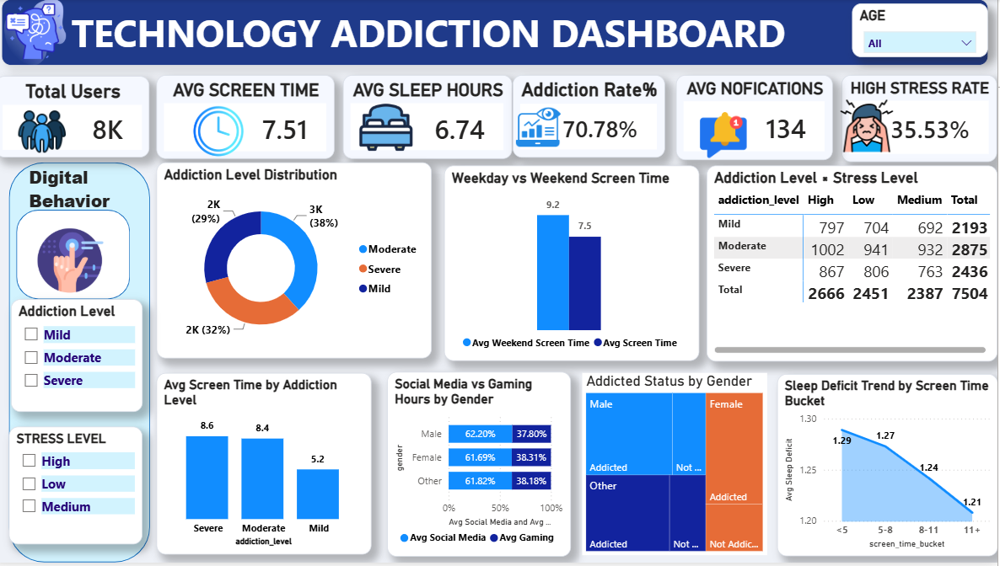
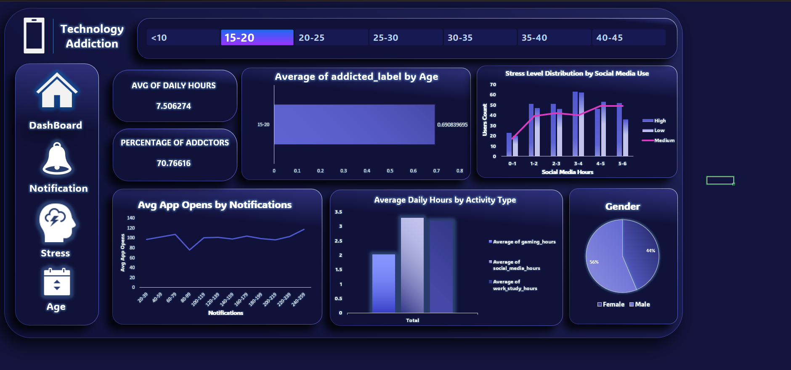
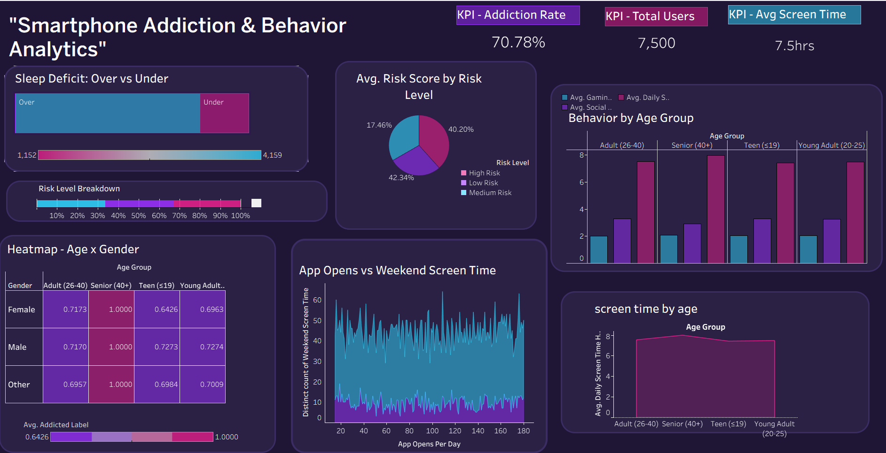

# 📱 Technology Addiction Analysis

An end-to-end Data Analytics project exploring smartphone addiction using **Python, SQL, Excel, Power BI, and Tableau**. This project analyzes smartphone usage patterns, identifies key factors contributing to smartphone addiction, and presents insights through interactive dashboards and data storytelling.

---

# 📖 Project Overview

Smartphone addiction has become one of the most significant digital lifestyle challenges. This project analyzes data from **7,504 smartphone users** to understand how screen time, sleep, stress, notifications, and app usage relate to smartphone addiction.

The project covers the complete analytics workflow from data cleaning to dashboard development and presentation.

---

# 🎯 Objectives

- Analyze smartphone usage behavior.
- Identify factors associated with smartphone addiction.
- Build interactive dashboards.
- Develop a custom Risk Score to identify high-risk users.
- Deliver insights using storytelling and data visualization.

---

# 📊 Dataset

The dataset contains information for **7,504 users**, including:

- Age
- Gender
- Daily Screen Time
- Weekend Screen Time
- Social Media Hours
- Gaming Hours
- Sleep Hours
- Notifications Per Day
- App Opens Per Day
- Stress Level
- Addiction Level

---

# 🛠️ Tools & Technologies

- Python
- SQL
- Microsoft Excel
- Power BI
- Tableau
- Jupyter Notebook

---

# 🔄 Project Workflow

```
Raw Dataset
      │
      ▼
Data Cleaning
      │
      ▼
Exploratory Data Analysis
      │
      ▼
SQL Analysis
      │
      ▼
Dashboard Development
      │
      ▼
Business Insights
      │
      ▼
Presentation
```

---

# 📈 Key Insights

### 📌 Smartphone addiction is more common than expected.

More than **70.78%** of users were classified as addicted based on the dataset.

---

### 📌 Screen time is the strongest indicator of addiction.

Daily screen time consistently showed the strongest relationship with addiction severity compared to other variables.

---

### 📌 Weekend phone usage increases significantly.

- Average weekday screen time: **7.51 Hours**
- Average weekend screen time: **9.20 Hours**

Users spend even more time on their phones during weekends.

---

### 📌 Higher addiction is associated with higher stress.

Users with severe smartphone addiction tend to experience higher stress levels.

---

### 📌 Risk Score

A custom **Risk Score (0–100)** was developed using:

- Screen Time (30%)
- Sleep Deficit (25%)
- Notifications (20%)
- Stress Level (15%)
- App Opens (10%)

The score successfully identifies users with a higher likelihood of smartphone addiction.

---

# 📊 Dashboards

## 📈 Power BI Dashboard

Interactive dashboard featuring:

- KPIs
- Addiction Distribution
- Stress Analysis
- Weekend vs Weekday Usage
- Screen Time Analysis
- Sleep Analysis



---

## 📊 Excel Dashboard

Dashboard focusing on:

- Overall KPIs
- Notifications
- Stress Analysis
- Age Analysis
- Social Media Usage



---

## 📉 Tableau Dashboard

Interactive dashboard including:

- Risk Score Analysis
- Heatmaps
- Demographic Analysis
- Screen Time Trends
- Addiction Distribution



---

# 📂 Repository Structure

```
Technology-Addiction-Analysis
│
├── Dataset
├── Python_SQL
├── PowerBI
├── Tableau
├── Excel
├── Presentation
├── IMAGES
└── README.md
```

---

# 📽️ Presentation

A complete project presentation explaining:

- Project Story
- Methodology
- Dashboards
- Key Findings
- Final Recommendations

The presentation can be found in the **Presentation** folder.

---

# 👥 Team

| Member | Contribution |
|---------|--------------|
| **Mina Mamdouh** | Python • Power BI Dashboard |
| **Jana Osama** | Python • SQL • Tableau Dashboard |
| **Youssef Mohamed** | Excel Dashboard • Presentation |

---

# ✅ Final Conclusion

Smartphone addiction is influenced by multiple behavioral factors rather than a single metric. While screen time is the strongest indicator, combining it with stress, sleep quality, notifications, and app usage provides a more accurate understanding of digital behavior.

This project demonstrates how data analytics and visualization can transform raw behavioral data into meaningful insights that support healthier digital habits.
